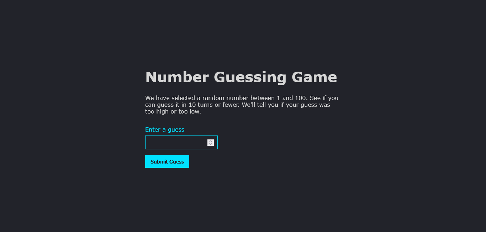

# Number Guessing Game

A simple number guessing game that generates a random number between 1-100. The player is then allowed to enter a number and the game will provide the player with feedback about the number they guessed. Weather it's equal to the random number, if it's less than the random number, or if it's greater than the random number.

## Overview

### The challenge

The game should do the following:

- Generate a random number between 1 and 100
- Record the turn the user is at.
- Provide the user with a way to guess the number
- Record the users guess and check if it's correct
- If the guess is correct congratulate the player
- If the guess is wrong and the player has turns left:
  - Tell the user the guess is wrong and say if the guess is too high or too low
  - Allow the player to guess again
  - Increment the turn number
- If the guess if wrong and user has no turns left end the game
- Allow the user to reset game

### Screenshot

## Author

- Website - [Number Guessing Game](https://zaidmarrie.github.io/number-guessing-game/)
- Twitter - [@LeKoels27](https://twitter.com/LeKoels27)
